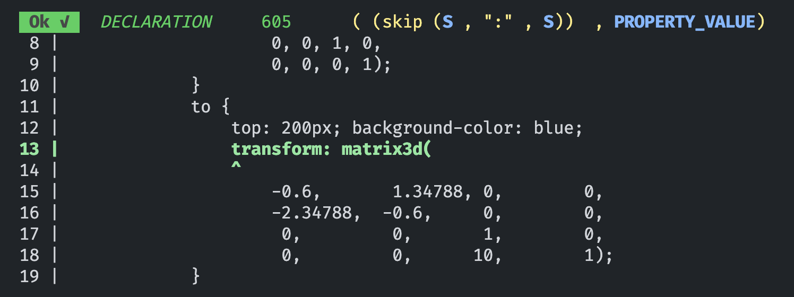

# parse`[that]`

Parser combinators for TypeScript and Rust.

Write your grammar in [`BBNF`](https://github.com/mkbabb/bbnf-lang) (Better
Backus-Naur Form) .

Handles left recursion and left factoring. Performance-focused with an emphasis on
readability.

## Usage

TypeScript:

```ts
import { string, regex } from "@mkbabb/parse-that";

const heyy = regex(/hey+t/);
heyy.parse("heyyyyyyyyyt"); // => "heyyyyyyyyyt"
```

Rust:

```rust
use parse_that::string;

let heyy = string("heyyyyyyyyyt");
heyy.parse("heyyyyyyyyyt"); // => "heyyyyyyyyyt"
```

Domain parsers ship with the library:

```ts
import { jsonParser, csvParser } from "@mkbabb/parse-that";

jsonParser().parse('{"key": [1, 2, 3]}');   // combinator-based
csvParser().parse('a,b,c\n1,2,3');          // RFC 4180
```

Or with a grammar (via [`bbnf-lang`](https://github.com/mkbabb/bbnf-lang)):

```ts
import { generateParserFromBBNF } from "@mkbabb/bbnf-lang";

const grammar = `
    expr = term, { ("+" | "-"), term };
    term = factor, { ("*" | "/"), factor };
    factor = number | "(", expr, ")";
    number = /[0-9]+/;
`;

const [nonterminals, ast] = generateParserFromBBNF(grammar);
const expr = nonterminals.expr;
expr.parse("1 + 2 * 3"); // => [1, "+", [2, "*", 3]]
```

## Table of Contents

- [Structure](#structure)
- [Performance](#performance)
  - [Rust](#rust)
  - [TypeScript](#typescript)
- [Debugging](#debugging)
  - [Diagnostics](#diagnostics)
  - [Error Recovery](#error-recovery)
- [BBNF and the Great Parser Generator](#bbnf-and-the-great-parser-generator)
- [Left Recursion](#left-recursion--more)
- [API & Examples](#api--examples)
- [Sources](#sources-acknowledgements--c)

## Structure

```
typescript/            TS library (@mkbabb/parse-that v0.8.1)
  src/parse/           Isomorphic module layout (see below)
  test/                Vitest tests + benchmark comparators
rust/                  Rust workspace (nightly, edition 2024)
  parse_that/          Core lib — isomorphic module layout (see below)
  src/                 CLI binary (parse_that_cli)
grammar/               Shared test vectors (BBNF grammars in bbnf-lang repo)
  tests/json/          Shared JSON test vectors
  tests/css/           CSS recovery test vectors
  tests/debug/         Shared diagnostic output vectors
docs/                  Perf chronicles, API reference
```

Both languages share a mirrored module structure:

| Module | TypeScript (`src/parse/`) | Rust (`parse_that/src/`) |
|---|---|---|
| Core | `parser.ts` — Parser\<T\> class | `parse.rs` — Parser\<'a, O\> struct |
| Combinators | methods on Parser class (incl. recover) | `combinators.rs` — impl blocks (incl. recover) |
| Leaf parsers | `leaf.ts` — string, regex, dispatch | `leaf.rs` — string, regex, dispatch_byte |
| Lazy eval | `lazy.ts` — lazy(), getLazyParser | `lazy.rs` — LazyParser, lazy() |
| Span / zero-copy | `span.ts` — regexSpan, manySpan, altSpan, takeUntilAnySpan | `span_parser.rs` — SpanParser enum |
| Balanced splitting | `split.ts` — splitBalanced | `split.rs` — split_balanced |
| State | `state.ts` — ParserState, Span | `state.rs` — ParserState, Span |
| Debug | `debug.ts` — diagnostics, ANSI output | `debug.rs` — diagnostics (feature-gated) |
| Domain parsers | `parsers/` — JSON, CSV, CSS | `parsers/` — JSON + scanners, CSV, CSS |

## Performance

All benchmarks run on Apple M-series (AArch64). JSON parsing with full DOM
materialization and string escape decoding. Higher is better.

### Rust

MB/s throughput. `bencher` crate with `black_box` on inputs and `b.bytes` set.

#### 10-parser JSON matrix

| Parser | data.json | apache | twitter | citm_catalog | canada | data-xl |
|---|---:|---:|---:|---:|---:|---:|
| sonic-rs | 2,222 | 1,888 | 2,299 | 2,920 | 1,456 | 2,646 |
| simd-json | 1,460 | 1,392 | 1,538 | 1,267 | 487 | 1,584 |
| jiter | 1,257 | 1,113 | 1,004 | 986 | 556 | 1,308 |
| serde_json_borrow | 1,165 | 1,122 | 1,292 | 1,268 | 617 | 1,196 |
| **parse_that** | **779** | **727** | **788** | **922** | **389** | **999** |
| nom | 576 | 690 | 496 | 607 | 391 | 601 |
| serde_json | 576 | 533 | 549 | 851 | 559 | 602 |
| winnow | 524 | 645 | 525 | 581 | 390 | 582 |
| parse_that (BBNF) | 852 | 875 | 866 | 736 | 305 | 663 |
| pest | 255 | 272 | 222 | 250 | 154 | 249 |

parse_that uses SIMD string scanning (`memchr2`), integer fast path (`madd` +
`ucvtf`), `Vec` objects (no HashMap), `u32` keyword loads, `Cow<str>` zero-copy
strings, and `#[cold]` escape decoding.

The BBNF-generated parser uses `#[derive(Parser)]` from a `.bbnf` grammar file—zero
hand-written Rust. Hybrid codegen phases (number regex substitution, transparent
alternation elimination, inline match dispatch, SpanParser dual methods, recursive
SpanParser codegen) reach 66–120% of the hand-written parser depending on dataset.

See [docs/perf-optimization-rust.md](docs/perf-optimization-rust.md) for the full
optimization chronicle.

### TypeScript

Relative to `JSON.parse` (native C++). Vitest bench, 5 iterations, 5s warmup.

| Parser | data (35KB) | apache (124KB) | twitter (617KB) | citm (1.7MB) | canada (2.1MB) |
|---|---:|---:|---:|---:|---:|
| JSON.parse (native) | 1.00x | 1.00x | 1.00x | 1.00x | 1.00x |
| **parse-that** | **5.04x** | **4.95x** | **6.64x** | **6.64x** | **2.65x** |
| Chevrotain | 6.21x | 6.98x | — | — | — |
| Peggy | 23.3x | 24.6x | — | — | — |
| Parsimmon | 26.5x | 29.9x | — | — | — |
| Nearley + moo | 65.2x | — | — | — | — |

Key optimizations: mutable `ParserState` (zero-alloc), Tarjan's SCC for minimal
lazy wrappers, FIRST-set dispatch tables (O(1) alternation), regex
`test()`+`substring()` (no `RegExpMatchArray` alloc), inline `wrap()`.

See [docs/perf-optimization-ts.md](docs/perf-optimization-ts.md) for the full
optimization chronicle.

### CSS

Rust MB/s on normalize.css (6KB), bootstrap.css (281KB), tailwind-output.css (3.6MB):

| Parser | normalize | bootstrap | tailwind | Level |
|---|---:|---:|---:|---|
| **parse_that** (hand-rolled) | **494** | **244** | **229** | L1.75 — typed AST |
| BBNF-generated | 614 | 341 | 215 | L1 — opaque spans |
| lightningcss | 229 | 104 | — | L2 — semantic |
| cssparser | 660 | 421 | 254 | L0 — tokenizer only |

parse_that (L1.75) builds a fully typed AST: selectors (compound/complex), values
(dimension/color/function), typed media queries (conditions, features, range ops),
typed @supports conditions, and specificity computation. Monolithic byte-level
scanners with memchr SIMD. The BBNF-generated parser is faster on
normalize/bootstrap because it produces L1 opaque spans (no typed AST
construction overhead).

TypeScript (relative to parse-that):

| Parser | normalize (6KB) | bootstrap (274KB) |
|---|---:|---:|
| **parse-that** (L1.75) | **1.00x** | **1.00x** |
| postcss (L1) | 1.65x slower | 1.34x slower |
| css-tree (L1-L2) | 2.43x slower | 2.13x slower |

## Debugging

The `debug` combinator pretty-prints parser state during execution.



As output, you'll see:

- **Header**: parsing status (`Ok`/`Err`/`Done`), current offset, node name, stringified parser
- **Body**: surrounding lines of input with the cursor at the active column, line-numbered

Color-coded: BBNF nonterminals in blue, stringified parsers in yellow.

### Diagnostics

Both implementations ship a structured diagnostics system — Rust behind a
`diagnostics` Cargo feature, TypeScript via `enableDiagnostics()` /
`disableDiagnostics()`. Zero overhead when off.

When enabled, parsers accumulate at the furthest offset:

- **Expected sets** — leaf parsers pre-compute labels at construction time
  (`"hello"`, `/[0-9]+/`, `one of ['a'-'z']`). Alternation chains merge them
  into `expected X, Y, or Z` (Oxford comma).
- **Suggestions** — `wrap()` detects unclosed delimiters and emits
  `help: unclosed '(' — insert matching ')'`; EOF checks flag trailing content.
- **Secondary spans** — point back to related source locations
  (`unclosed '{' opened here`) for multi-site error context.

Rich rendering: ANSI color output with TTY detection and `NO_COLOR` respect,
center-truncation of long lines around the error column, ±4 lines of context
with gutter line numbers. Shared test vectors in `grammar/tests/debug/` ensure
isomorphic output between TypeScript and Rust.

### Error Recovery

The `recover(sync, sentinel)` combinator enables multi-error parsing — the
standard technique used by production compilers (rustc, GCC, clang) to parse
past failures and keep going.

```ts
const decl = declaration.trim().recover(declSync, "RECOVERED");
const block = decl.many(0).wrap("{", "}");
```

On failure, `recover()` snapshots the current diagnostic state into a
`Diagnostic` object (expected sets, suggestions, secondary spans, source
location), pushes it to a collection, then invokes the sync parser to skip
forward to a known recovery point (`;`, `}`, etc.) and returns the sentinel.
`many()` loops keep going — each failed element produces a diagnostic but
doesn't halt the overall parse.

```ts
clearCollectedDiagnostics();
stylesheet.parse(cssWithErrors);
const diagnostics = getCollectedDiagnostics();
console.error(formatAllDiagnostics(diagnostics, css));
```

Both TypeScript and Rust expose the same API: `collectDiagnostic()` /
`push_diagnostic()`, `getCollectedDiagnostics()` / `get_collected_diagnostics()`,
`formatDiagnostic()` / `format_diagnostic()`. Rust uses thread-local storage;
TypeScript uses module-level globals. See
`grammar/tests/css/complex-errors.css` for a multi-error test vector.

## BBNF and the Great Parser Generator

Better Backus-Naur Form: a readable, practical grammar notation. An extension of
[EBNF](https://dwheeler.com/essays/dont-use-iso-14977-bbnf.html) with skip/next
operators, regex terminals, mapping functions, and an `@import` system.

The BBNF grammar for BBNF itself lives in the [`bbnf-lang`](https://github.com/mkbabb/bbnf-lang) repo.

With your grammar in hand, call `generateParserFromBBNF` (TypeScript) or use
`#[derive(Parser)]` (Rust):

```ts
const [nonterminals, ast] = generateParserFromBBNF(grammar);
```

```rust
#[derive(Parser)]
#[parser(path = "grammar/json.bbnf")]
pub struct Json;

let result = Json::value().parse(input);
```

Each nonterminal is a `Parser` object. The BBNF parser-generator is itself written in
BBNF—self-hosting. The BBNF ecosystem (compiler, LSP, VS Code extension) lives in the
separate [`bbnf-lang`](https://github.com/mkbabb/bbnf-lang) repo.

### Operators

| Syntax | Meaning |
|---|---|
| `A?` / `[ A ]` | Optional A |
| `A*` / `{ A }` | Repeated A (0 or more) |
| `A+` | Repeated A (1 or more) |
| `A \| B` | A or B (higher precedence than `,`) |
| `A, B` | A followed by B |
| `A - B` | A, but not B |
| `A >> B` | A then B, return B only |
| `A << B` | A then B, return A only |
| `( A )` | Grouping |

Emojis supported. Epsilon has a special value: `ε`.

## Left recursion & more

Direct and indirect left recursion are fully supported, as are highly ambiguous
grammars:

```bbnf
expr = expr , "+" , expr
     | integer
     | string ;
```

### Using BBNF

The BBNF compiler optimizes the grammar automatically:
1. Topological sort via Tarjan's SCC
2. Remove indirect left recursion
3. Remove direct left recursion
4. Left factorize

### Combinator support

Left recursion via `memoize` and `mergeMemos`:

```ts
const expression = Parser.lazy(() =>
    all(expression, operators.then(expression).opt()).mergeMemos().or(number)
).memoize();
```

See [memoize.test.ts](./typescript/test/memoize.test.ts) for details.

### Caveats

Left recursion works but isn't optimal. If it can be factored out via BBNF,
performance will be fine; otherwise expect slowdowns, since JavaScript lacks proper
tail call optimization.

## API & examples

See [api.md](./docs/api.md) for API information.

See the [TypeScript tests](./typescript/test/) and [Rust tests](./rust/parse_that/tests/)
for working examples.

## Sources, acknowledgements, & c.

### Theory

- Aho, A. V., Lam, M. S., Sethi, R., & Ullman, J. D. (2006). *Compilers: Principles, Techniques, and Tools* (2nd ed.). Addison-Wesley. — The Dragon Book. Left recursion elimination, left factoring, FIRST/FOLLOW sets.
- Frost, R., Hafiz, R., & Callaghan, P. (2008). [Parser combinators for ambiguous left-recursive grammars](https://dl.acm.org/doi/10.1145/1328408.1328424). *PADL '08*. — Memoized top-down parsing with left recursion support.
- Frost, R. & Hafiz, R. (2006). [A new top-down parsing algorithm to accommodate ambiguity and left recursion in polynomial time](https://dl.acm.org/doi/10.1145/1149982.1149988). *ACM SIGPLAN Notices*.
- Moore, R. C. (2000). [Removing left recursion from context-free grammars](http://research.microsoft.com/pubs/68869/naacl2k-proc-rev.pdf). *NAACL '00*.
- Tarjan, R. E. (1972). Depth-first search and linear graph algorithms. *SIAM Journal on Computing*. — SCC detection for grammar cycle analysis and FIRST-set computation.
- Power, J. (n.d.). [Formal theory of parsing](http://www.cs.may.ie/~jpower/Courses/parsing/parsing.pdf). NUI Maynooth lecture notes.

### Notation

- [Extended Backus-Naur form](https://en.wikipedia.org/wiki/Extended_Backus%E2%80%93Naur_form) — ISO 14977. BBNF's ancestor.
- Wheeler, D. A. [Don't Use ISO 14977 EBNF](https://dwheeler.com/essays/dont-use-iso-14977-bbnf.html). — Motivation for BBNF's deviations from the standard.

### Performance

- Eisel, D. & Lemire, D. (2021). [Number parsing at a gigabyte per second](https://arxiv.org/abs/2101.11408). — `fast_float2` crate for Rust JSON float parsing.
- [memchr](https://docs.rs/memchr/latest/memchr/) — SIMD-accelerated byte scanning. Used for `memchr2`-based JSON string scanning on AArch64 (NEON) and x86 (SSE2/AVX2).
- `rustc_ast/format.rs` — [Rust compiler source](https://github.com/rust-lang/rust/blob/8bfcae730a5db2438bbda72796175bba21427be1/rust/compiler/rustc_ast/src/format.rs#L169). Reference for `u32` keyword matching pattern.

### Parser libraries (competitors and influences)

- [Parsimmon](https://github.com/jneen/parsimmon) — Monadic TS parser combinators. Benchmarked as baseline.
- [Chevrotain](https://github.com/chevrotain/chevrotain) — TS parser toolkit with CST. Closest TS competitor.
- [nom](https://github.com/rust-bakery/nom) — Rust parser combinators. The Rust ecosystem standard.
- [winnow](https://github.com/winnow-rs/winnow) — nom's successor with improved dispatch.
- [pest](https://github.com/pest-parser/pest) — PEG parser for Rust. Grammar-driven.
- [sonic-rs](https://github.com/bytedance/sonic-rs) — ByteDance's SIMD JSON parser. The ceiling in our benchmarks.
- [simd-json](https://github.com/simd-lite/simd-json) — Rust port of simdjson's 3-phase architecture.
- [jiter](https://github.com/pydantic/jiter) — Pydantic's scalar JSON parser. Closest peer to our fast path.
