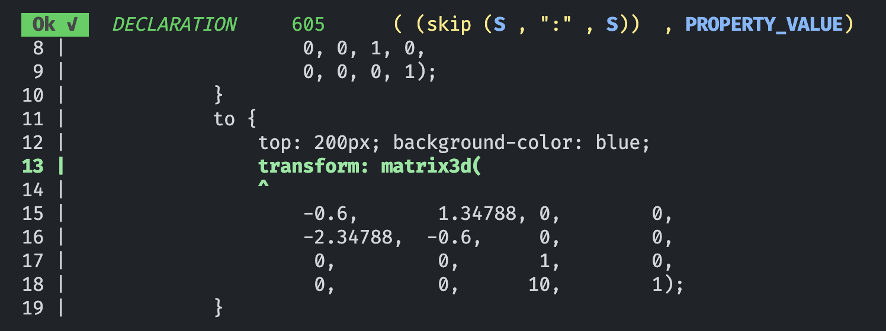

# parse`[that]`

Parser combinators for TypeScript and Rust.

Write your language in [`BBNF`](https://github.com/mkbabb/bbnf-language-support) (better
backus-naur form) .

Handles left recursion and left factoring. Performance focused whilst maintaining
readability and ease of use.

## Usage

TypeScript:

```ts
import { string, regex } from "@mkbabb/parse-that";

const heyy = regex(/hey+t/);
heyy.parse("heyyyyyyyyyt"); // => "heyyyyyyyyyt"
```

Rust:

```rust
use parse_that::string;

let heyy = string("heyyyyyyyyyt");
heyy.parse("heyyyyyyyyyt"); // => "heyyyyyyyyyt"
```

Or with a grammar:

```ts
import { string, match, generateParserFromBBNF } from "@mkbabb/parse-that";

const grammar = `
    expr = term, { ("+" | "-"), term };
    term = factor, { ("*" | "/"), factor };
    factor = number | "(", expr, ")";
    number = /[0-9]+/;
`;

const [nonterminals, ast] = generateParserFromBBNF(grammar);
const expr = nonterminals.expr;
expr.parse("1 + 2 * 3"); // => [1, "+", [2, "*", 3]]
```

## Table of Contents

- [Performance](#performance)
  - [Rust](#rust)
  - [TypeScript](#typescript)
- [Debugging](#debugging)
- [BBNF and the Great Parser Generator](#bbnf-and-the-great-parser-generator)
- [Left Recursion](#left-recursion--more)
- [API & Examples](#api--examples)
- [Sources](#sources-acknowledgements--c)

## Performance

All benchmarks run on Apple M-series (AArch64). JSON parsing with full DOM
materialization and string escape decoding. Higher is better.

### Rust

MB/s throughput. `bencher` crate with `black_box` on inputs and `b.bytes` set.

#### parse_that (fast) vs. the field

| Dataset | parse_that (fast) | serde_json | nom | pest |
|---|---:|---:|---:|---:|
| **data.json** (35 KB) | **1,607** | 601 | 611 | 259 |
| **apache-builds** (127 KB) | **1,680** | 548 | 724 | 281 |
| **canada** (2.1 MB) | **641** | 568 | 401 | 158 |
| **twitter** (632 KB) | **1,716** | 579 | 516 | 243 |
| **citm_catalog** (1.7 MB) | **1,572** | 842 | 629 | 255 |
| **data-xl** (39 MB) | **1,708** | 623 | 626 | 267 |

#### All parsers (prior benchmark run, 11-parser matrix)

| Parser | data.json | canada | apache | twitter | citm_catalog | data-xl |
|---|---:|---:|---:|---:|---:|---:|
| sonic-rs | 2,307 | 1,520 | 1,892 | 2,511 | 3,019 | 2,769 |
| **parse_that (fast)** | **1,609** | **646** | **1,709** | **1,732** | **1,599** | **1,730** |
| simd-json | 1,395 | 498 | 1,456 | 1,530 | 1,327 | 1,655 |
| jiter | 1,341 | 579 | 1,137 | 1,027 | 992 | 1,402 |
| serde_json_borrow | 1,219 | 623 | 1,140 | 1,340 | 1,309 | 1,245 |
| parse_that (combinator) | 1,037 | 452 | 1,008 | 921 | 827 | 1,174 |
| nom | 615 | 399 | 722 | 514 | 627 | 619 |
| serde_json | 607 | 569 | 546 | 582 | 864 | 624 |
| winnow | 550 | 392 | 635 | 540 | 597 | 594 |
| pest | 259 | 160 | 283 | 244 | 257 | 268 |
| parse_that (BBNF) | 14 | -- | -- | -- | -- | -- |

The fast path is a monolithic recursive parser with: SIMD string scanning
(`memchr2`), integer fast path (`madd` + `ucvtf`), `Vec` objects (no HashMap),
`u32` keyword loads, `Cow<str>` zero-copy strings, and `#[cold]` escape decoding.

See [docs/perf-optimization-rust.md](docs/perf-optimization-rust.md) for the full
optimization chronicle.

### TypeScript

ops/s on data.json (35 KB). Vitest bench with 5 iterations, 5s warmup.

| Parser | ops/s | vs. native |
|---|---:|---:|
| JSON.parse (native) | 22,361 | 1.0x |
| **parse-that (hand-written)** | **5,499** | **4.1x** |
| **parse-that (BBNF-generated)** | **4,728** | **4.7x** |
| Chevrotain | 4,099 | 5.5x |
| Parsimmon | 965 | 23.2x |

#### Multi-dataset results (prior benchmark run)

| Dataset | JSON.parse | Hand | BBNF | Chevrotain | Peggy | Parsimmon | Nearley |
|---|---:|---:|---:|---:|---:|---:|---:|
| **data.json** (35 KB) | 24,738 | 5,480 | 4,779 | 4,100 | 1,107 | 985 | 386 |
| **apache-builds** (124 KB) | 7,149 | 1,477 | 1,328 | 1,035 | 299 | 243 | 82 |
| **twitter** (555 KB) | 1,566 | 243 | 213 | 166 | 63 | 44 | 21 |
| **citm_catalog** (1.7 MB) | 680 | 117 | 102 | 76 | 24 | 17 | 8 |
| **canada** (2.1 MB) | 133 | 56 | 44 | 29 | 15 | 7 | 4 |

Key optimizations: mutable `ParserState` (zero-alloc), Tarjan's SCC for minimal
lazy wrappers, FIRST-set dispatch tables (O(1) alternation), regex
`test()`+`substring()` (no `RegExpMatchArray` alloc), inline `wrap()`.

See [docs/perf-optimization-ts.md](docs/perf-optimization-ts.md) for the full
optimization chronicle.

## Debugging

Debugging is made pretty by using the `debug` combinator.



As output, you'll see:

- **Header**: parsing status (`Ok`/`Err`), current offset, node name, stringified parser
- **Body**: up to 10 lines of input with the current offset denoted by `^`, with line numbers

The `blue` color indicates a BBNF nonterminal; `yellow` is the stringified parser.

## BBNF and the Great Parser Generator

Better Backus-Naur Form is a simple and readable way to describe a language. A
[better](https://dwheeler.com/essays/dont-use-iso-14977-bbnf.html) EBNF.

See the BBNF for BBNF (meta right) at [bbnf.bbnf](./grammar/bbnf.bbnf).

With your grammar in hand, call `generateParserFromBBNF` (TypeScript) or use
`#[derive(Parser)]` (Rust):

```ts
const [nonterminals, ast] = generateParserFromBBNF(grammar);
```

```rust
#[derive(Parser)]
#[parser(path = "grammar/json.bbnf")]
pub struct Json;

let result = Json::value().parse(input);
```

Each nonterminal is a `Parser` object. Fully featured and self-parsing — the BBNF
parser-generator is written in BBNF. See [bbnf.test.ts](./typescript/test/bbnf.test.ts).

### Operators

| Syntax | Meaning |
|---|---|
| `A?` / `[ A ]` | Optional A |
| `A*` / `{ A }` | Repeated A (0 or more) |
| `A+` | Repeated A (1 or more) |
| `A \| B` | A or B (higher precedence than `,`) |
| `A, B` | A followed by B |
| `A - B` | A, but not B |
| `A >> B` | A then B, return B only |
| `A << B` | A then B, return A only |
| `( A )` | Grouping |

Emojis supported. Epsilon has a special value: `ε`.

## Left recursion & more

This library fully supports left recursion (direct or indirect) and highly
ambiguous grammars:

```bbnf
expr = expr , "+" , expr
     | integer
     | string ;
```

### Using BBNF

The BBNF compiler optimizes the grammar automatically:
1. Topological sort via Tarjan's SCC
2. Remove indirect left recursion
3. Remove direct left recursion
4. Left factorize

### Combinator support

Left recursion via `memoize` and `mergeMemos`:

```ts
const expression = Parser.lazy(() =>
    all(expression, operators.then(expression).opt()).mergeMemos().or(number)
).memoize();
```

See [left-recursion.md](./docs/left-recursion.md) and
[memoize.test.ts](./typescript/test/memoize.test.ts) for details.

### Caveats

Left recursion works but is not optimal. If it can be factored out via BBNF the
performance will be fine; otherwise you may see slowdowns due to JavaScript's lack
of tail call optimization.

## API & examples

See [api.md](./docs/api.md) for API information.

See the [TypeScript tests](./typescript/test/) and [Rust tests](./rust/parse_that/tests/)
for working examples.

## Sources, acknowledgements, & c.

- [EBNF](https://en.wikipedia.org/wiki/Extended_Backus%E2%80%93Naur_form)
- [Left recursion](https://en.wikipedia.org/wiki/Left_recursion)
- [Notes on parsing EBNF](https://www.cs.umd.edu/class/spring2003/cmsc330/Notes/bbnf/bbnf.html)
- [Formal theory of parsing](http://www.cs.may.ie/~jpower/Courses/parsing/parsing.pdf)
- [Removing left recursion from CFGs](http://research.microsoft.com/pubs/68869/naacl2k-proc-rev.pdf)
- [Top-down parsing for ambiguous left-recursive grammars](https://dl.acm.org/doi/10.1145/1149982.1149988)
- [Modular top-down parsing for ambiguous left-recursive grammars](https://www.researchgate.net/profile/Richard-Frost-5/publication/30053225)

Parser libraries:

- [Parsimmon](https://github.com/jneen/parsimmon)
- [Chevrotain](https://github.com/chevrotain/chevrotain)
- [nom](https://github.com/rust-bakery/nom)
- [pest](https://github.com/pest-parser/pest)
- [winnow](https://github.com/winnow-rs/winnow)
